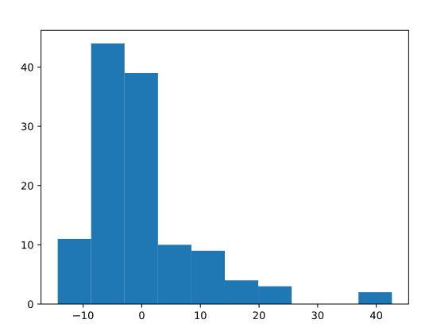

# Data Transformation

## Numerical Transformation

When we take our numerical data and change it into another numerical value. This is meant to change the scale of our values or even adjust the skewness of our data. You may be thinking, “we already have our data in numbers. Why would we want to change those?” Well, first of all, that is a great question. We’ll dive deep into the “why we do this” throughout this lesson. To put it simply, we do this to help our model better compare features and, most importantly, improve our model’s accuracy and interpretability. That sounds like some good reasons to put the time and effort into numerical transformations if I do say so myself.

We’ll focus on the following numerical transformations:

- Centering
- Standard Scaler
- Min and Max Scaler
- Binning
- Log transformations

Let’s get to know the data frame we will be using. This dataset has just over 100 responses from customers where they were asked about a recent Starbucks experience. You will soon notice that we have a mix of numerical and categorical data, but we’ll focus only on the numerical features for this lesson.

```python
import pandas as pd 
# Import the file
coffee = pd.read_csv('starbucks_customers.csv')
# Printing columns
print(coffee.columns)
# Printing features from data frame
print(coffee.info())
```

## Data Centering

Involves subtracting the mean of a data set from each data point so that the new mean is 0. This process helps us understand how far above or below each of our data points is from the mean.

We will find the mean of our feature, create one line of code to center our data, and then plot the centered data. Here’s what it will look like in Python.

```python
#get the mean of your feature
mean_dis = np.mean(distance)

#take our distance array and subtract the mean_dis, this will create a new series with the results
centered_dis = distance - mean_dis

#visualize your new list
plt.hist(centered_dis, bins = 5, color = 'g')

#label our visual
plt.title('Starbucks Distance Data Centered')
plt.xlabel('Distance from Mean')
plt.ylabel('Count')
plt.show();
```

Example on our starbucks studycase:

```python
import pandas as pd
import numpy as np
import matplotlib.pyplot as plt 
import codecademylib3_seaborn 

coffee = pd.read_csv('starbucks_customers.csv')

# Setting age feature (from csv) to a variable called 'ages'
ages = coffee['age']

# Finding minimum age in our feature
min_age = np.min(ages)
print(min_age)

# Finding maximum age in our feature
max_age = np.max(ages)
print(max_age)

age_dif = max_age - min_age
print(age_dif)

# Finding mean age to center our data
mean_age = np.mean(ages)
print(mean_age)

# Finding distance between mean and data
centered_ages = ages - mean_age
print(centered_ages)

# Plotting data
plt.hist(centered_ages)
plt.show()
```

Final Plot



## Standarizing Data

Standardization (also known as Z-Score normalization) is when we center our data, then divide it by the standard deviation. Once we do that, our entire data set will have a mean of zero and a standard deviation of one. This allows all of our features to be on the same scale. How cool is that?

This step is critical because some machine learning models will treat all features equally regardless of their scale. You’ll definitely want to standardize your data in the following situations:

- Before Principal Component Analysis
- Before using any clustering or distance based algorithm
- Before KNN
- Before performing regularization methods like LASSO and Ridge

If I wanted to see how customers rated quality vs. price, I could graph a scatter plot of those two features and easily see that customers tend to score those two questions closely. Notice the darker spots (meaning more data points are laying on top of one another) around the 3.0 for “Rate Quality” and 3.0 for “Rate Price” as an example. This insight was easy to see since our features are on the same one to five scale.


Now, what happens if I am working with features on two totally different scales? Perhaps the “customer age” and “how far they live from a Starbucks” feature? Let’s take a look.


Looking at this, it is much more challenging to gain insight or even identify patterns within our data. This will be a similar experience for our machine learning models. That’s why when we standardize our entire dataset, we tend to see a more robust model performance if all features are on the same scale.

Let’s examine one feature to learn the mathematics that goes on when we standardize our data. The mathematical formula will look like this:

$$
z = \frac{value-mean}{stdev}

$$

We’ll look at just one feature, where customers were asked how close they are to their nearest Starbucks, and follow that formula above. First, we will set our `nearest_starbucks` feature to its own variable and then find the mean and standard deviation. Then we can quickly standard our list following the formula above.

```python
distance = coffee['nearest_starbucks']

#find the mean of our feature
distance_mean = np.mean(distance)

#find the standard deviation of our feature
distance_std_dev = np.std(distance)
    
#this will take each data point in distance subtract the mean, then divide by the standard deviation
distance_standardized = (distance - distance_mean) / distance_std_dev
```

We now have our distance feature standardized! Let’s double-check by seeing what the mean and standard deviation of our array is.

```python
# print what type distance_standardized is
print(type(distance_standardized))
#output = <class 'pandas.core.series.Series'>

#print the mean
print(np.mean(distance_standardized))
#output = 7.644158530205996e-17

#print the standard deviation
print(np.std(distance_standardized))
#output = 1.0000000000000013
```

Now let’s practice with our `ages` feature:

```python
import pandas as pd
import numpy as np

coffee = pd.read_csv('starbucks_customers.csv')
ages = coffee['age']

# Prepare variables
mean_age = np.mean(ages)
std_dev_age = np.std(ages)

## Standardize ages
ages_standardized = (ages - mean_age) / (std_dev_age)

## Print mean and stdev of standardized data
print(np.mean(ages_standardized)) 
print(np.std(ages_standardized)) 
```

Stdev near to 1

## Standardizing Data with Sklearn

Now that we understand the mathematics behind a standard scaler let’s quickly implement it with the sklearn library. We will begin by importing our `StandardScaler` library from `sklearn.preprocessing`.

```python
from sklearn.preprocessing import StandardScaler
scaler = StandardScaler()
```

We instantiate the `StandardScaler` by setting it to a variable called `scaler` which we can then use to transform our feature. The next step is to reshape our distance array. `StandardScaler` must take in our array as 1 column, so we’ll reshape our distance array using the `.reshape(-1,1)` method. 

This numpy method says to take our data and give it back to us as 1 column, represented in the second value. The -1 asks numpy to figure out the exact number of rows to create based on our data.

 

```python
reshaped_distance = np.array(distance).reshape(-1,1)
distance_scaler = scaler.fit_transform(reshaped_distance)
```

Just like we learned in the last lesson, we do this so our data has a mean of 0 and standard deviation of 1. Let’s print to see how the StandardScaler did.

```python
print(np.mean(distance_scaler))
#output = -9.464196275493137e-17
print(np.std(distance_scaler))
#output = 0.9999999999999997
```

You’ll notice the `e-17` at the end of our output for the mean, and that is our number written in exponential notation. Written in standard notation our answer is `-0.00000000000000009464196275493137`. Which basically has the mean at 0 and our standard deviation = 1. Great work! Now you can try to standardize the age column with the new knowledge you just gained.

```python
import pandas as pd
import numpy as np
from sklearn.preprocessing import StandardScaler 

coffee = pd.read_csv('starbucks_customers.csv')
ages = coffee['age']

# Instantiate Sklearn tool
scaler = StandardScaler()

# Reshape feature
ages_reshaped = np.array(ages).reshape(-1, 1)

# Transform agesreshaped feature
ages_scaled = scaler.fit_transform(ages_reshaped)

# Print mean and stdev
print(np.mean(ages_scaled))
print(np.std(ages_scaled))
```

## Min/Max Normalization

Another form of scaling your data is to use a min-max normalization process. The name says it all, we find the minimum and maximum data point in our entire data set and set each of those to 0 and 1, respectively. Then the rest of the data points will transform to a number between 0 and 1, depending on its distance between the minimum and maximum number. We find that transformed number by taking the data point subtracting it from the minimum point, then dividing by the value of our maximum minus minimum.

$$
X_{norm} = \frac{X-X_{min}}{X_{max}- X_{min}}
$$

The reason we would want to normalize our data is very similar to why we would want to standardize our data - getting everything on the same scale.

 We’ll write a function that will perform the mathematics needed to transform the entire column.

```python
distance = coffee['nearest_starbucks']

#find the min value in our feature
distance_min = np.min(distance)

#find the max value in our feature
distance_max = np.max(distance)

#normalize our feature by following the formula
distance_normalized = (distance - distance_min) / (distance_max - distance_min)
```

Excellent! Now if I were to print all the unique numbers in `distance_norm` here is what we will see.

```python
{0.0, 0.125, 0.25, 0.375, 0.5, 0.625, 0.75, 0.875, 1.0}
```

We will now work with the `spent` feature in our data frame.

```python
import pandas as pd
import numpy as np

coffee = pd.read_csv('starbucks_customers.csv')

# Get spent feature
spent = coffee['spent']

# Find the max spent
max_spent = np.max(spent)

# Find the min spent
min_spent = np.min(spent)

# Find the difference
spent_range = max_spent - min_spent
print(spent_range)

# Normalize your spent feature
spent_normalized = (spent - min_spent) / spent_range

# Print your results
print(spent_normalized)
```

## Min/Max Normalization with Sklearn

We will start by importing our `MinMaxScaler` library from `sklearn.preprocessing`. Just like we covered in the StandardScaler exercise, we start by instantiating the `MinMaxScaler` by setting it to a variable called `mmscaler` which we can then use to transform our feature.

```python
from sklearn.preprocessing import MinMaxScaler
mmscaler = MinMaxScaler()
```

The next step is to import our distance feature and reshape it so it is ready for our `mmscaler`.

```python
#get our distance feature
distance = coffee['nearest_starbucks']

#reshape our array to prepare it for the mmscaler
reshaped_distance = np.array(distance).reshape(-1,1)

#.fit_transform our reshaped data
distance_norm = mmscaler.fit_transform(reshaped_distance)

#see unique values
print(set(np.unique(distance_norm)))
#output = {0.0, 0.125, 0.25, 0.375, 0.5, 0.625, 0.75, 0.875, 1.0}
```

Now we’re going to normalize our featuer `spent` 

```python
import pandas as pd
import numpy as np
from sklearn.preprocessing import MinMaxScaler

coffee = pd.read_csv('starbucks_customers.csv')
spent = coffee['spent']

# Reshaping feature
spent_reshaped = np.array(spent).reshape(-1,1)

# Instantiate MinMaxScaler
mmscaler = MinMaxScaler()

# Transform our reshaped data
reshaped_scaled = mmscaler.fit_transform(spent_reshaped)

# Print min and max, = 0 && 1 ?
print(np.min(reshaped_scaled))
print(np.max(reshaped_scaled))
```

## Binning our Data

Binning data is the process of taking numerical or categorical data and breaking it up into groups. We could decide to bin our data to help capture patterns in noisy data. There isn’t a clean and fast rule about how to bin your data, but like so many things in machine learning, you need to be aware of the trade-offs.

You want to make sure that your bin ranges aren’t so small that your model is still seeing it as noisy data. Then you also want to make sure that the bin ranges are not so large that your model is unable to pick up on any pattern. It is a delicate decision to make and will depend on the data you are working with.

Going back to our customer data and looking at our distance feature, let’s look at the data with a histogram.


We can easily see that a lot of customers who completed this survey live fairly close to a Starbucks, and our data has a range of 0 km to 8km. I wonder how our data would transform if we were to bin our data in the following way:

- distance < 1km
- 1.1km <= distance < 3km
- 3.1km <= distance < 5km
- 5.1km <= distance

First, we’ll set the upper boundaries of what we listed above.

```python
bins = [0, 1, 3, 5, 8.1]
```


Let’s bin our `age`  feature:

```python
import pandas as pd
import numpy as np
import matplotlib.pyplot as plt
import codecademylib3_seaborn 

coffee = pd.read_csv('starbucks_customers.csv')
ages = coffee['age']

# Print min and max values
print(np.min(ages))
print(np.max(ages))

# Create bin boundaries
age_bins = [12, 20, 30, 40, 71]

# Create new bin column
coffee['binned_ages'] = pd.cut(ages, age_bins, right = False)

# Print first 10 rows
print(coffee['binned_ages'].head(10))

# Plot binned data
coffee['binned_ages'].value_counts().plot(kind='bar')
plt.show()
```


## Natural Log Transformation

Logarithms are an essential tool in statistical analysis and [machine learning](https://www.codecademy.com/resources/docs/general/machine-learning) preparation. This transformation works well for right-skewed data and data with large outliers. After we log transform our data, one large benefit is that it will allow the data to be closer to a “normal” distribution. It also changes the scale so our data points will drastically reduce the range of their values.

For example, let’s explore a whole new data set from Kaggle around used car prices. Take a look at this histogram plot of 100,000 used car odometers.

```python
import pandas as pd

#import our dataframe
cars = pd.read_csv('cars.csv')

#set our variable
odometer = cars['odometer']

#graph our odometer readings
plt.hist(odometer, bins = 200, color = 'g')

#add labels
plt.xticks(rotation = 45)
plt.title('Number of Cars by Odometer Reading')
plt.ylabel('Number of Cars')
plt.xlabel('Odometer')
plt.show();
```


This histogram is right-skewed, where the majority of our data is located on the left side of our graph. If we were to provide this feature to our machine learning model it will see a lot of different cars with odometer readings off on the left of our graph. It will not see a lot of examples with very high odometer readings. This may cause issues with our model, as it may struggle to pick up on patterns that are within those examples off on the right side of our histogram.

We’ll perform a log transformation using numpy to see how our data will transform.

```python
import numpy as np

#perform the log transformation
log_car = np.log(cars['odometer'])

#graph our transformation
plt.hist(log_car, bins = 200, color = 'g')

#rotate the x labels so we can read it easily
plt.xticks(rotation = 45)

#provide a title
plt.title('Logarithm of Car Odometers')
plt.show();
```


Our data looks much closer to a normal distribution! If we were to look at a sample of five different cars with varying odometer readings, let’s examine how the log transformation changed their values.

| make | odometer | odometer_logged |
| --- | --- | --- |
| Altima | 10126 | 9.222862 |
| Jetta | 34042 | 10.435350 |
| Camry | 56762 | 10.946622 |
| Civic | 100103 | 11.513955 |
| F-150 | 145695 | 11.889271 |
| Saturn | 151687 | 11.929574 |

If we compare the Altima with 10,126 miles to the Saturn with 151,687 miles those two cars have a huge difference in odometer readings. Yet, once we log transform the data we see the range from 9.22 to 11.93 is much smaller. Compressing the range of our data can help our model perform better!

There is so much more to add about log transformation. For the purpose of this exercise we just want to give a high overview and demonstrate how to log transform your data. Before we have you start testing your new skills let’s quickly cover two major topics with log transformation:

1. Using a log transformation in a machine learning model will require some extra interpretation. For example, if you were to log transform your data in a linear regression model, our independent variable has a multiplication relationship with our dependent variable instead of the usual additive relationship we would have if our data was not log-transformed.
2. Keep in mind, just because your data is skewed does not mean that a log transformation is the best answer. You would not want to log transform your feature if:
    - You have values less than 0. The natural logarithm (which is what we’ve been talking about) of a negative number is undefined.
    - You have left-skewed data. That data may call for a square or cube transformation.
    - You have non-parametric data

Now let’s work with `prices` feature from Cars dataframe 

```python
import pandas as pd 
import numpy as np
import matplotlib.pyplot as plt
import codecademylib3_seaborn 

# Read in csv file
cars = pd.read_csv('cars.csv')

# Set price variable
prices = cars['sellingprice']

# Plot a histogram of prices
plt.hist(prices, bins = 150)
plt.show()

# Log transform prices
log_prices = np.log(prices)

# Plot a histogram of log prices
plt.hist(log_prices, bins = 150)
plt.show()
```

