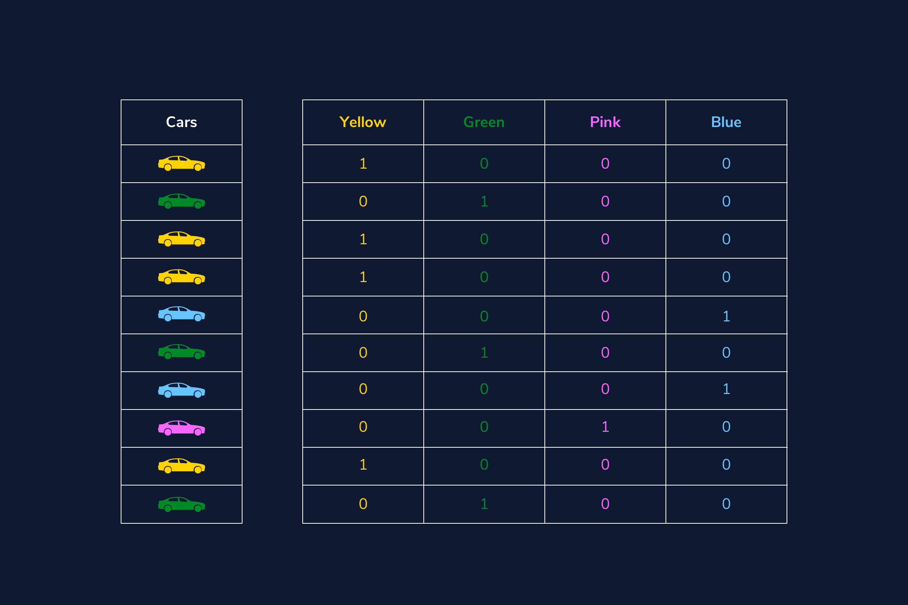

# Categorical Variables

Categorical data is data that has more than one category. When working with that type of data we have two types, nominal and ordinal. *Nominal data* is data that has no particular order or hierarchy to it, and *ordinal data* is categorical data where the categories have order, but the differences between the categories are not important or unclear.

We will be working with a dataset of used cars for this article to truly understand and demonstrate how to work with categorical data. Let’s explore it and see what type of data we are working with.

```python
import pandas as pd

# import data
cars = pd.read_csv('cars.csv')

# check variable types
print(cars.dtypes)
## OUTPUT
# year              int64
# make             object
# model            object
# trim             object
# body             object
# transmission     object
# vin              object
# state            object
# condition        object
# odometer        float64
# color            object
# interior         object
# seller           object
# mmr               int64
# sellingprice      int64
# saledate         object
```

## Ordinal Encoding

We mentioned already that *ordinal data* is data that does have order and a hierarchy between its values. Let us take a look at the `condition` feature from our data frame and perform a `value_counts` to see how many times each label is listed in our feature.

```python
print(cars['condition'].value_counts())
# #OUTPUT
# New          2881
# Like New     2860
# Good         2027
# Fair          753
# Excellent     186
```

This is definitely an example of ordinal data: the condition of the used cars can easily be put in order of those in the “best” condition to the cars in the “worst” condition. The output printed the labels with the highest counts, but we can assume the following hierarchy:

- Excellent
- New
- Like New
- Good
- Fair

We need to convert these labels into numbers, and we can do this with two different approaches. First, we can do this by creating a dictionary where every label is the key and the new numeric number is the value. ‘Excellent’ will get the highest score and ‘Fair’ will be our lowest score. Then we will map each label from the `condition` column to the numeric value and create a new column called `condition_rating`.

```python
# create dictionary of label:values in order
rating_dict = {'Excellent':5, 'New':4, 'Like New':3, 'Good':2, 'Fair':1}

#create a new column 
cars['condition_rating'] = cars['condition'].map(rating_dict)
```

### Encoding with Sklearn

To utilize the `sklearn.preprocessing` library `OrdinalEncoder`. We follow a similar approach: we set our categories as a list, and then we will `.fit_transform` the values in our feature `condition`. We need to make sure we adhere to the shape requirements of a 2-D array, so you’ll notice the method `.reshape(-1,1)`.

We’ll also note, this method will not work if your feature has `NaN` values. Those need to be addressed prior to running `.fit_transform`.

```python
# using scikit-learn
from sklearn.preprocessing import OrdinalEncoder

# create encoder and set category order
encoder = OrdinalEncoder(categories=[['Excellent', 'New', 'Like New', 'Good', 'Fair']])

# reshape our feature
condition_reshaped = cars['condition'].values.reshape(-1,1)

# create new variable with assigned numbers
cars['condition_rating'] = encoder.fit_transform(condition_reshaped)
```

## Label Encoding

Now, we can talk about *nominal data*, and we have to approach this type of data differently than what we did with *ordinal data*. Our `color` feature has a lot of different labels, but here are the top five colors that appear in our data frame.

```python
print(cars['color'].nunique())
# #OUTPUT 
# 19

print(cars['color'].value_counts()[:5])
# #OUTPUT
# black     2015
# white     1931
# gray      1506
# silver    1503
# blue       869
```

To prepare this feature, we still need to convert our text to numbers, so let’s do just that. We will demonstrate two different approaches, with the first one showing how to convert the feature from an `object` type to a `categories` type.

```python
# convert feature to category type
cars['color'] = cars['color'].astype('category')

# save new version of category codes
cars['color'] = cars['color'].cat.codes

# print to see transformation
print(cars['color'].value_counts()[:5])
# #OUTPUT
# 2     2015
# 18    1931
# 8     1506
# 15    1503
# 3      869
```

Comparing our newly transformed data to the original top 5 list, we can see Black was transformed to number 2, White was transformed to 18, and so on.

However, we have created a problem for ourselves and potentially our model. We can see that ‘Blue’ cars now have a value of 3, and our model will assume that ‘Blue’ has lower precedence over the ‘Black’ car, whose color has a value of 2. Since ‘Blue’ cars = 3 and ‘White’ cars = 18, our model could actually give ‘White’ cars 6 times more weight than a ‘Blue’ car simply because of the way we encoded this feature. To combat this ordinal assumption our model will make, we should *one-hot encode* our nominal data, which we will cover in the next section.

One more way we can transform this feature is by using `sklearn.preprocessing` and the `LabelEncoder` library. This method will not work if your feature has `NaN` values. Those need to be addressed prior to running `.fit_transform`.

```python
from sklearn.preprocessing import LabelEncoder

# create encoder
encoder = LabelEncoder()

# create new variable with assigned numbers
cars['color'] = encoder.fit_transform(cars['color'])
```

## One-hot Encoding

One-hot encoding is when we create a dummy variable for each value of our categorical feature, and a *dummy variable* is defined as a numeric variable with two values: 1 and 0. We will continue to talk about our `color` feature from our used car dataset.

Looking at this visual below, we can see we have ten cars in four different colors. In place of the single `color` column, we create four dummy variables - one new column for each color. Then the values that go into that column are binary, indicating if the car in that row is the color of the column name (`1`) or not (`0`).



This approach is great for our color feature and will allow the model to see each category as its own feature and not try to create order between a “Black car” and a “Red car”. Here is how we can implement this in Python:

```python
import pandas as pd
# use pandas .get_dummies method to create one new column for each color
ohe = pd.get_dummies(cars['color'])

# join the new columns back onto our cars dataframe
cars = cars.join(ohe)
```

A downside to this approach is that it can create a lot of features which can then create a very sparse matrix.

## Binary Encoding

If we find the need to one-hot encode a lot of categorical features which would, in turn, create a sparse matrix and may cause problems for our model, a strong alternative to this issue is performing a *binary encoder*. A *binary encoder* will find the number of unique categories and then convert each category to its binary representation. Let us take a quick review of binary numbers and keep using our `color` feature. We know that we have 19 unique colors, so the way to represent the numbers from 1 to 19 in binary format is as follows:

We can easily see that our highest number 19 is 5 digits long, so our binary encoder will need 5 columns to be able to represent all digits. Here is a sample of how our `color` column will transform each color if we were to perform a binary encoder.


Our 19th color, pink, has transformed to be represented in the binary form 10011. If we were to utilize this process instead of the traditional one-hot encoder we would have 5 numerical features instead of 19, reducing our features by about 75%!

To make this happen with Python we’ll use a library called `category_encoders` and import `BinaryEncoder`. We will determine which column to transform and set `drop_invariant` to `True` so it will keep the five binary columns. If it is set to the default 0, then we would have an additional column full of zeros.

```python
from category_encoders import BinaryEncoder

#this will create a new data frame with the color column removed and replaced with our 5 new binary feature columns
colors = BinaryEncoder(cols = ['color'], drop_invariant = True).fit_transform(cars)
```

## Hashing

Another option we have available to us is an encoding technique called *hashing*. This process is similar to one-hot encoding where it will create new binary columns, but within the parameters, you can decide how many features to output. A huge advantage is reduced dimensionality, but a large disadvantage is that some categories will be mapped to the same values. That is called *collision*.

For example, we have 19 different colored cars. If I were to use the hash encoder and set the number of features to be 5, I will definitely have a few colors with the same hash values.


We can easily see that brown and charcoal colors have the same hash values. Meaning, we’ve lost some information and our model won’t be able to see the difference between those two colors.

Here is how we can make this work with Python.

```python
from category_encoders import HashingEncoder

# instantiate our encoder
encoder = HashingEncoder(cols='color', n_components=5)

# do a fit transform on our color column and set to a new variable
hash_results = encoder.fit_transform(cars['color'])
```

This could be a solution to your project and dataset if you are not as interested in assessing the impact of any particular categorical value.

For this example, maybe you aren’t interested in knowing which color car had an impact on your final prediction, but you want to be able to get the best performance from your model. This encoding solution may be a good approach.