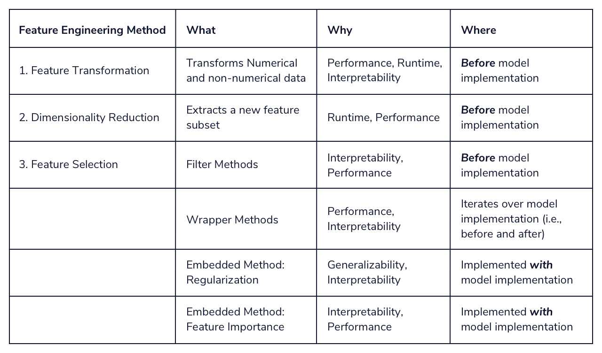

# Feature Engineering

Before we can talk about feature engineering, we have to define what we mean by ‘features’. A feature is a measurable property in a dataset, and a feature can be used as an input to a machine learning model. One way to think about features is as predictor variables that go into a model to predict the outcome variable. For example, if we want a model that predicts precipitation at a given place and time, we might use temperature, humidity, month, altitude, etc. as inputs. These are our features.

It is an umbrella term for the techniques we use to help us make decisions about features in machine learning model implementations.

What would make a model implementation functional or dysfunctional? Consider the following four attributes:

### **1. Performance:**

We would like our machine learning model to perform “well” on our data. If it is not able to predict the outcome variable (to a reasonable degree of accuracy) on known data, it would be unwise to use it to predict outcomes on unknown data.

### **2. Runtime:**

Suppose a model has excellent performance but takes a really long time to run. For a data scientist, depending on their available computational resources, such a model might be impractical for production.

### **3. Interpretability:**

A model is only as good as the insights it helps us glean from the data. Data scientists are often tasked with finding out what factors drive different outcomes. A well-performing model would not be of much help if it’s opaque and uninterpretable.

### **4. Generalizability:**

We would like our model to generalize well to unseen data. Often data scientists work with streaming data and need their model to be flexible with new and unknown data..

Feature engineering can be thought of as a toolkit of techniques to use when a model is missing one or more of the above attributes. If we imagine a model diagnostic machine (kind of like a modern version of this one) with meters representing the attributes, feature engineering would be akin to turning knobs and pushing buttons until we arrive upon a model that meets all of our attributes satisfactorily.

## Feature Engineering Methods

