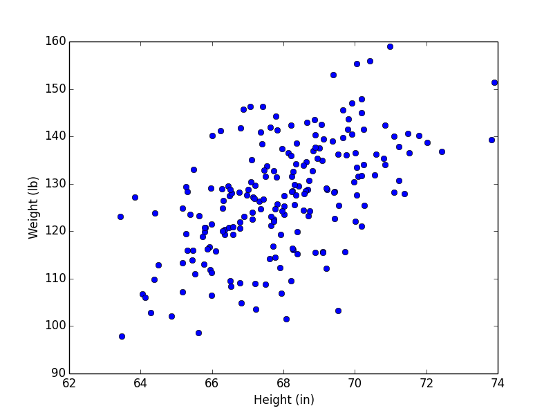
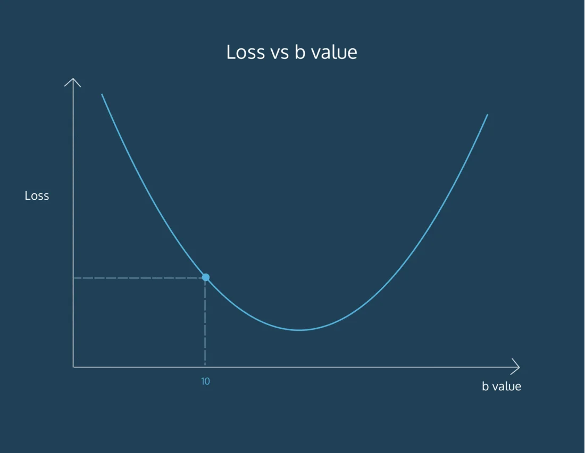
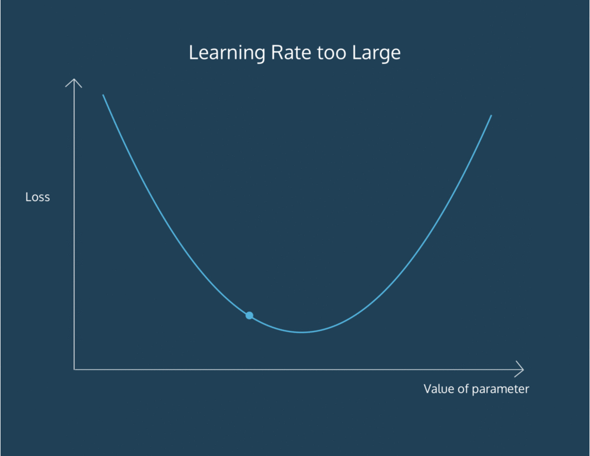

# Linear Regression

The purpose of [machine learning](https://www.codecademy.com/resources/docs/general/machine-learning) is often to create a model that explains some real-world data, so that we can predict what may happen next, with different inputs.

The simplest model that we can fit to data is a line. When we are trying to find a line that fits a set of data best, we are performing **Linear Regression**.

We often want to find lines to fit data, so that we can predict unknowns. For example:

- The market price of a house vs. the square footage of a house. Can we predict how much a house will sell for, given its size?
- The tax rate of a country vs. its GDP. Can we predict taxation based on a country’s GDP?
- The amount of chips left in the bag vs. number of chips taken. Can we predict how much longer this bag of chips will last, given how much people at this party have been eating?

Imagine that we had this set of weights plotted against heights of a large set of professional baseball players:



To create a linear model to explain this data, we might draw this line:


A line is a rough approximation, but it allows us the ability to explain and predict [variables](https://www.codecademy.com/resources/docs/general/julia/variables) that have a linear relationship with each other. In the rest of the lesson, we will learn how to perform Linear Regression.

## Points and Lines

For our program to make the same level of guess, we have to determine what a line would look like through those data points.

A line is determined by its *slope* and its *intercept*. In other words, for each point `y` on a line we can say:

$$
y = mx+b
$$

where `m` is the slope, and `b` is the intercept. `y` is a given point on the y-axis, and it corresponds to a given `x` on the x-axis.

The slope is a measure of how steep the line is, while the intercept is a measure of where the line hits the y-axis.

When we perform Linear Regression, the goal is to get the “best” `m` and `b` for our data. We will determine what “best” means in the next exercises.

## Loss

When we think about how we can assign a slope and intercept to fit a set of points, we have to define what the *best fit* is.

For each data point, we calculate **loss**, a number that measures how bad the model’s (in this case, the line’s) prediction was. You may have seen this being referred to as error.

We can think about loss as the squared distance from the point to the line. We do the squared distance (instead of just the distance) so that points above and below the line both contribute to total loss in the same way:


In this example:

- For point A, the squared distance is `9` (3²)
- For point B, the squared distance is `1` (1²)

So the total loss, with this model, is `10`. If we found a line that had less loss than `10`, that line would be a better model for this data.

```python
x = [1, 2, 3]
y = [5, 1, 3]

#y = x
m1 = 1
b1 = 0
y_predicted1 = [m1*x_values + b1 for x_values in x] 
#y = 0.5x + 1
m2 = 0.5
b2 = 1
y_predicted2 = [m2*x_values + b2 for x_values in x] 

total_loss1 = sum([(y[i] - y_predicted1[i]) ** 2 for i in range(len(y))])

print(total_loss1)

total_loss2 = sum([(y[i] - y_predicted2[i]) ** 2 for i in range(len(y))])

print(total_loss2)
```

## Minimizing Loss

As we try to minimize loss, we take each [parameter](https://www.codecademy.com/resources/docs/general/parameter) we are changing, and move it as long as we are decreasing loss. It’s like we are moving down a hill, and stop once we reach the bottom:


The process by which we do this is called **gradient descent**. We move in the direction that decreases our loss the most. *Gradient* refers to the slope of the curve at any point.

For example, let’s say we are trying to find the intercept for a line. We currently have a guess of `10` for the intercept. At the point of `10` on the curve, the slope is downward. Therefore, if we increase the intercept, we should be lowering the loss. So we follow the gradient downwards.



We derive these gradients using calculus. It is not crucial to understand how we arrive at the gradient equation. To find the gradient of loss as intercept changes, the formula comes out to be:

$$
-\frac{2}{N} \sum_{i=1}^{N} \left( y_i - (m x_i + b) \right)
$$

- `N` is the number of points we have in our dataset
- `m` is the current gradient guess
- `b` is the current intercept guess

Basically:

- we find the sum of `y_value - (m*x_value + b)` for all the `y_value`s and `x_value`s we have
- and then we multiply the sum by a factor of `2/N`. `N` is the number of points we have.

```python
def get_gradient_at_b(x, y, m, b):
  diff = sum([(y[i] - (m*x[i] + b)) for i in range(0, len(x))])
  b_gradient = (-2/len(x)) * diff
  return b_gradient
```

## Gradient Descent for Slope

We have a function to find the gradient of `b` at every point. To find the `m` gradient, or the way the loss changes as the slope of our line changes, we can use this formula:

$$
-\frac{2}{N} \sum_{i=1}^{N} x_i \left( y_i - (m x_i + b) \right)
$$

Once more:

- `N` is the number of points you have in your dataset
- `m` is the current gradient guess
- `b` is the current intercept guess

To find the `m` gradient:

- we find the sum of `x_value * (y_value - (m*x_value + b))` for all the `y_value`s and `x_value`s we have
- and then we multiply the sum by a factor of `2/N`. `N` is the number of points we have.

Once we have a way to calculate both the `m` gradient and the `b` gradient, we’ll be able to follow both of those gradients downwards to the point of lowest loss for both the `m` value and the `b` value. Then, we’ll have the best `m` and the best `b` to fit our data!

```python
def get_gradient_at_b(x, y, m, b):
    diff = 0
    N = len(x)
    for i in range(N):
      y_val = y[i]
      x_val = x[i]
      diff += (y_val - ((m * x_val) + b))
    b_gradient = -2/N * diff
    return b_gradient

def get_gradient_at_m(x, y, m, b):
  diff = sum([x[i] * (y[i] - (m*x[i] + b)) for i in range(len(x))])
  m_gradient = -2/len(x) * diff
  return m_gradient
```

## Convergence

How do we know when we should stop changing the parameters `m` and `b`? How will we know when our program has learned enough?

To answer this, we have to define convergence. **Convergence** is when the loss stops changing (or changes very slowly) when parameters are changed.

Hopefully, the [algorithm](https://www.codecademy.com/resources/docs/general/algorithm) will converge at the best values for the parameters `m` and `b` .

## Learning Rate

We want our program to be able to iteratively *learn* what the best `m` and `b` values are. So for each `m` and `b` pair that we guess, we want to move them in the direction of the gradients we’ve calculated. But how far do we move in that direction?

We have to choose a **learning rate**, which will determine how far down the loss curve we go.

A small learning rate will take a long time to converge — you might run out of time or cycles before getting an answer. A large learning rate might skip over the best value.



Finding the absolute best learning rate is not necessary for training a model. You just have to find a learning rate large enough that gradient descent converges with the efficiency you need, and not so large that convergence never happens.

We can use Python’s scikit-learn library. Scikit-learn, or `sklearn`, is used specifically for

[Machine Learning](https://www.codecademy.com/resources/docs/general/machine-learning). Inside the `linear_model` module, there is a `LinearRegression()` function we can use:

```python
from sklearn.linear_model import LinearRegression
```

You can first create a `LinearRegression` model, and then fit it to your `x` and `y` data:

```python
line_fitter = LinearRegression()
line_fitter.fit(X,y)
```

The `.fit()` [method](https://www.codecademy.com/resources/docs/general/method) gives the model two [variables](https://www.codecademy.com/resources/docs/general/julia/variables) that are useful to us:

1. the `line_fitter.coef_`, which contains the slope
2. the `line_fitter.intercept_`, which contains the intercept

We can also use the `.predict()` function to pass in x-values and receive the y-values that this line would predict:

```python
y_predicted = line_fitter.predict(X)
```

**Note:** the `num_iterations` and the `learning_rate` that you learned about in your own implementation have default values within scikit-learn, so you don’t need to worry about setting them specifically!