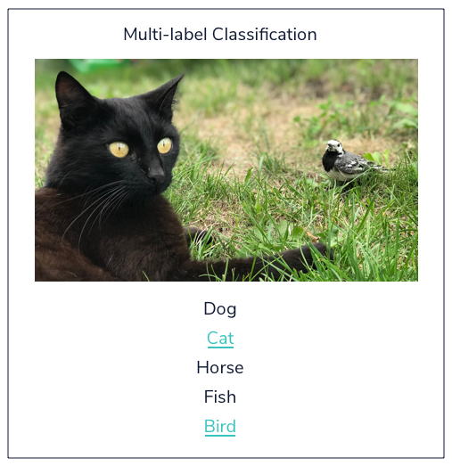

# Supervised Learning

## Regression

Machine Learning can be branched out into the following categories:

- Supervised Learning
- Unsupervised Learning

[Supervised Learning](https://www.codecademy.com/articles/machine-learning-supervised-vs-unsupervised) is where the data is labeled and the program learns to predict the output from the input data. For instance, a supervised learning [algorithm](https://www.codecademy.com/resources/docs/general/algorithm) for credit card fraud detection would take as input a set of recorded transactions. For each [transaction](https://www.codecademy.com/resources/docs/general/database/transaction), the program would predict if it is fraudulent or not.

Supervised learning problems can be further grouped into regression and classification problems.

**Regression:**

In regression problems, we are trying to predict a continuous-valued output. Examples are:

- What is the housing price in New York?
- What is the value of cryptocurrencies?

**Classification:**

In classification problems, we are trying to predict a discrete number of values. Examples are:

- Is this a picture of a human or a picture of a cyborg?
- Is this email spam?

## Classification Example

An exclusive nightclub in Neo York doesn’t want to serve robots, but technology has advanced so far that it’s hard for bouncers to tell humans from robots just by looking. To help the bouncers, the nightclub created a model that uses the k-nearest neighbors [algorithm](https://www.codecademy.com/resources/docs/general/algorithm) to distinguish between humans and robots based on how long it takes them identify blurry pictures or traffic lights.

```python
import numpy as np
import pandas as pd
from sklearn.neighbors import KNeighborsClassifier

# Load the data
photo_id_times = pd.read_csv('photo_id_times.csv')

# Separate the data into independent and dependent variables
X = np.array(photo_id_times['Time to id photo']).reshape(-1, 1)
y = photo_id_times['Class']

# Create a model and fit it to the data
neigh = KNeighborsClassifier(n_neighbors=3)
neigh.fit(X, y)

time_to_identify_picture = 5

# Make a prediction based on how long it takes to identify a picture
y_pred = neigh.predict(np.array(time_to_identify_picture).reshape(1, -1))

if y_pred == 1:
    print("We think you're a robot.")
else:
    print("Welcome, human!")
```

---

When we explicitly tell a program what we expect the output to be, and let it learn the rules that produce expected outputs from given inputs, we are performing supervised learning.


## Regression vs Classification

### Regression

Regression is used to predict outputs that are *continuous*. The outputs are quantities that can be flexibly determined based on the inputs of the model rather than being confined to a set of possible labels.

For example:

- Predict the height of a potted plant from the amount of rainfall
- Predict salary based on someone’s age and availability of high-speed internet
- Predict a car’s MPG (miles per gallon) based on size and model year


Linear regression is the most popular regression algorithm. It is often underrated because of its relative simplicity. In a business setting, it could be used to predict the likelihood that a customer will churn or the revenue a customer will generate. More complex models may fit this data better, at the cost of losing simplicity.

### Classification

Classification is used to predict a *discrete label* . The outputs fall under a finite set of possible outcomes. Many situations have only two possible outcomes. This is called *binary classification*

(True/False, 0 or 1).

For example:

- Predict whether an email is spam or not
- Predict whether it will rain or not
- Predict whether a user is a power user or a casual user

There are also two other common types of classification: *multi-class classification* and *multi-label classification*.

Multi-class classification has the same idea behind binary classification, except instead of two possible outcomes, there are three or more.

For example:

- Predict whether a photo contains a pear, apple, or peach
- Predict what letter of the alphabet a handwritten character is
- Predict whether a piece of fruit is small, medium, or large


An important note about binary and multi-class classification is that in both, each outcome has one specific label. However, in multi-label classification, there are multiple possible labels for each outcome. This is useful for customer segmentation, image categorization, and sentiment analysis for understanding text. To perform these classifications, we use models like Naive Bayes, K-Nearest Neighbors, SVMs, as well as various deep learning models.

An example of multi-label classification is shown below. Here, a cat and a bird are both identified in a photo showing a classification model with more than one label as a result.

